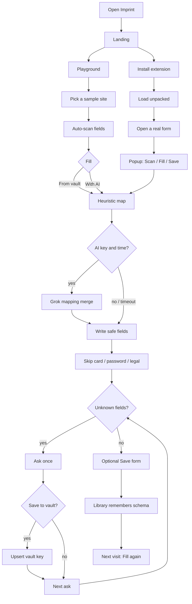
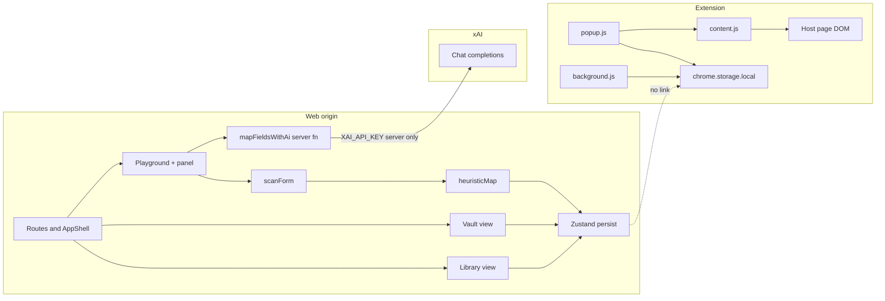

# Imprint roadmap — workflow and system design

This is the product map: how a fill actually runs, how the two surfaces are wired, and what lands next. It does not replace [architecture.md](architecture.md) (structure) or [audit.md](audit.md) (defects).

## 1. What the product is

Imprint stamps identity onto forms.

Two surfaces, **one idea**, **two stores**:

| Surface | Who uses it | Where data lives |
| :--- | :--- | :--- |
| Web app (this origin) | Learn and demo | `localStorage` (Zustand) |
| Chrome / Edge extension | Real pages | `chrome.storage.local` |

They never sync. Maya in the playground is not the vault in the popup.

## 2. User workflow



### 2.1 Landing

Wordmark only. Two cards:

- **Playground** — sample job, checkout, civic, clinic, signup forms with Maya already loaded.
- **Extension** — ZIP (Load unpacked) and packed CRX.

Hover fills the cream action from the left. No vault chrome here.

### 2.2 Playground loop

1. Site mounts → scan the fake page DOM.
2. Heuristic map against the active vault profile.
3. **Fill from vault** writes matches immediately.
4. **Fill with AI** still starts from heuristics, then may merge Grok results (10s cap). If the key is missing or the call dies, heuristics stay.
5. Leftover fields enter the **ask** queue. One prompt at a time. Optional save-to-vault.
6. **Save** stores field list + mappings in the library, keyed by sample site.
7. Library **Fill again** reopens that site with the saved mapping.

Header on these routes: Playground | Vault | Library, plus Maya on the right.

### 2.3 Extension loop

1. User loads the unpacked `imprint` folder (or a store/enterprise CRX).
2. Vault starts **empty** — user types name, email, phone, address in **Edit vault**.
3. On a live page: **Scan** (content script reads inputs) → **Fill** (writes values, outlines fields) → asks for unknowns → **Save** remembers URL + schema.
4. Passwords, PAN, CVC, SSN-like, and legal checkboxes never write.

Header on this route: wordmark + “Extension”. No Maya.

### 2.4 Never-fill (hard gate)

Applied **before** any write, on both surfaces:

- `password` type
- card number / PAN / CVC / CVV
- SSN-like
- terms / privacy / agree / consent checkboxes

This is a security control, not a preference.

## 3. System design



### 3.1 Web app

| Piece | Role |
| :--- | :--- |
| `src/routes/*` | `/`, `/playground`, `/vault`, `/library`, `/extension` |
| `AppShell` | Route-aware chrome |
| `scan.ts` | Field discovery in a root node |
| `heuristic.ts` | Autocomplete + alias map, never-fill |
| `ai.ts` | Server function, JSON mappings, 10s abort |
| `store.ts` | Profiles, saved forms, persist to `localStorage` |
| Sample sites | In-app DOM only — not the user’s bank |

### 3.2 Extension

| Piece | Role |
| :--- | :--- |
| `manifest.json` | MV3, storage, activeTab, scripting, host match |
| `content.js` | Scan, skip, fill, highlight |
| `popup.js` | Scan / Fill / Save / ask / vault editor |
| `background.js` | Seed empty default vault on install |
| `pack-extension.py` | ZIP for Load unpacked + signed CRX3 |

Signing key: `scripts/imprint-pack.pem` (not under `public/`).

### 3.3 Mapping contract

Each field becomes a mapping:

- `vaultKey` + `value` when known
- `skipReason` when never-fill hits
- `needsInput` + `question` + `saveAsKey` when unknown

Heuristic runs first. AI may overwrite leftovers only. Asks consume `needsInput`.

### 3.4 Trust boundaries

```text
Untrusted: page labels, names, placeholders, host URL
Trusted on device: vault values the user typed
Trusted on server: XAI_API_KEY (never VITE_)
Never sent to a database: vault and saved forms
```

Popup must treat page-derived strings as untrusted (`escapeHtml` / text nodes).

## 4. Delivery roadmap

Aligned with [audit.md](audit.md). Severity is not the same as build order.

### Now (1.0)

- Landing with two paths
- Playground + demo vault
- Packed ZIP / CRX
- Heuristic fill, optional AI, ask-once, library
- Docs and ADRs (local vault, heuristic-first)

### Next (safety)

- Popup lists via DOM `textContent`, not HTML strings (F-002)
- Unit tests for never-fill and alias order (F-003)
- Decide store policy for host permissions: `activeTab` only vs idle scan (F-001)

### Later (product)

- Optional signed-in cloud vault (requires a new ADR; do not add auth-off shared rows)
- Chrome Web Store listing + privacy policy
- Shared mapping module so web and extension stop duplicating aliases
- Per-profile vaults in the extension (playground already has Personal / Work)

### Not on the roadmap

- OS diagnostic / remediation pipelines
- Filling cards, passwords, or legal boxes
- Syncing playground Maya into the Chrome vault without an explicit user action
- `VITE_` exposure of `XAI_API_KEY`

## 5. How to read this against other docs

| If you want… | Open |
| :--- | :--- |
| Folder-level wiring | [architecture.md](architecture.md) |
| Click-by-click usage | [usage.md](usage.md) |
| Why local-only | [ADR-0001](adr/0001-local-vault-no-cloud-accounts.md) |
| Why AI is second | [ADR-0002](adr/0002-heuristic-first-ai-second.md) |
| What to fix first | [audit.md](audit.md) |
